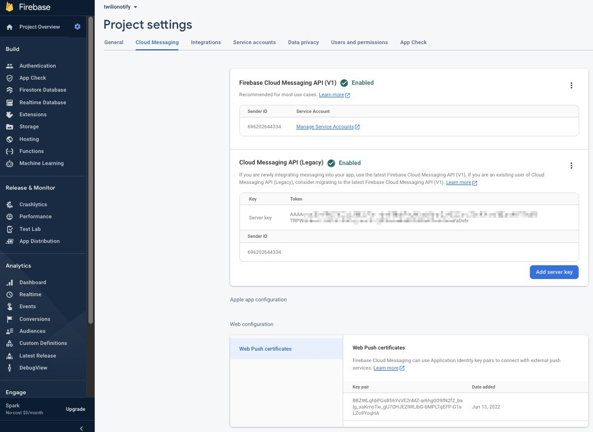
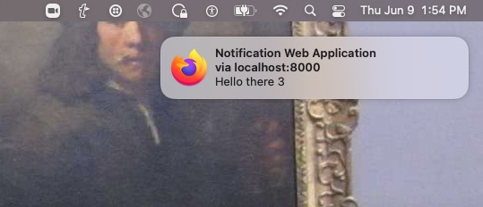

# Web Application Receive Notifications

This repository has 3 sample web applications to receive FCM notification and Twilio Notify notifications.
+ Directory [address](address) has a basic minimum sample web application, using FCM only, not using the Twilio Notify service.
+ Directory [bindings](bindings) has a web application sample that 
includes the "address" application functionality, plus uses Twilio Notify Bindings.
+ Directory [conversations](conversations) has a basic minimum Twilio Conversations sample web application.

Notes,
+ [Android](READMEandroid.md) on how web application notifications relates to Twilio Notify Android
    [quickstart app](https://github.com/TwilioDevEd/notifications-quickstart-android) notifications.
+ [iOS](READMEios.md) on Twilio Notify iOS Notification

--------------------------------------------------------------------------------
## Create a Google Firebase Project

This section cover the connection:
+ From your program to Twilio.
+ From Twilio to the FCM network.

Create a [Google Firebase project](https://console.firebase.google.com/)
to handle the communications between the Google Firebase Cloud Messaging (FCM) network and the device (computer or phone)
you will running the web application client.

I used my personal Google account and went through the following steps.
````
+ Click Add project.
+ Enter your project name, for example: twilionotify. 
A unique identifier is created, for example: twilionotify-2ab35.
Click Continue.
+ Disable Google Analytics for this project.
Click Create Project.
Your project will be created: "Your new project is ready".
Click Continue.
+ On the left, under Firebase, beside Project Overview, click the settings icon.
````
You are now in the project General settings.
````
+ Under Project settings, click Cloud Messaging.
+ Beside "Cloud Messaging API (Legacy) Disabled", click the right 3 dots.
A new tab will open on a new page that is titled: Cloud Messaging.
Click Enable.
You will be forward to another page: API APIs & Services.
Close this tab.
+ Back to the Project settings/Cloud Messaging and refresh the page.
The Server key Token is now displayed.
+ Farther down the page, under Web configuration/Web Push certificates, click Generate key pair.
````
You now have generated all the Google FCM codes required for notifications,
listed in the Project settings/Cloud Messaging option.
+ Firebase Server key Token
+ Sender ID
+ Web Push certificates: key pair.



--------------------------------------------------------------------------------
## Add the Firebase Server Key into a New Twilio Push Credential Entry

### Get Firebase Server Key

Go to the [Google project](https://console.firebase.google.com/)
twilionotify.
````
Firebase/Project Overview(click icon)/Project setting/Cloud Messaging
Get value for the Server key Token, for example: AAAA...x6r.
````

### Create a Notify Credential Entry and Include the Firebase Server Key Token

Create a new Notify Credential: 
[Push Credential entry](https://console.twilio.com/us1/account/keys-credentials/credentials?frameUrl=/console/[…]&_ga=2.106700427.985900128.1666307041-1107974050.1665436152).
````
Twilio Console, Account, select Credentials.
Verify to enter the management page.
Public Keys are for APN.
Click, Push Credentials to view the list.
````
Or,
````
Twilio Console, Notify/Services, click a service.
Click "here", in any of the services, for example: Create an FCM Credential here.
````
From the management page, can add or change a credential.

Example credential entry:
````
Friendly Name: twilionotify
Type: FCM
FCM Secret: AAAA...x6r (Firebase Server key Token)
````
Click Save.

Or, use command line programs to [manage push credentials](https://www.twilio.com/docs/conversations/api/credential-resource).

### Create a Notify Service and Include the new Credential

This step is not required for Twilio Conversations notifications
because Conversations manages the bindings in the background.

Create a Notify Service Instance: [Twilio Console link](https://www.twilio.com/console/notify/services). 

For example:
````
FRIENDLY NAME: notifyweb
FCM CREDENTIAL SID: twilionotify (the above newly created credential entry)
MESSAGING SERVICE SID: Default Twilio SMS message
Logging: enabled
````
Click Save.

Example Notify Service SID:
````
IS0e9b3863450252891f81f312a6e3a7d7
````

--------------------------------------------------------------------------------
### Web Appication Program Firebase Settings

Sending, use the Google Firebase project server key Token: AAAA...x6r

Receiving, from the same Google Firebase project, use the Web Push certificate's key pair: BBZWL...qHA
and the project number: 69...4.

In the receiving web app's index.html file:
````
var config = {
    apiKey: "BBZWL...qHA",
    messagingSenderId: "69...4"
};
firebase.initializeApp(config);
````
The firebase-messaging-sw.js file also contains the Firebase sender id:
````
firebase.initializeApp({
    'messagingSenderId': "69...4"     // Matches the value in index.html.
});
````
The notification message title is set in: firebase-messaging-sw.js
````
messaging.setBackgroundMessageHandler(function(payload) {
    ...
    const notificationTitle = 'Notification Web App';   // Notification background Message Title.
    ...
}
````
--------------------------------------------------------------------------------
### Background Notifications

If application is not running in the browser when a notification is received,
the notification is handled in the background.



Note, when using a Mac with screen mirroring (which I'm using, laptop closed, external monitor),
to receive background notifications, 
````
Go to the option: Apple/System Preferences.../Notifications & Focus.
Select the browser, for example: Firefox.
Enable: Allow notifications: When mirroring or sharing the display.
````

--------------------------------------------------------------------------------
## Next

Implement one of the web applications to receive notifications:
+ FCM [address](address)
+ Twilio Notify [bindings](bindings)
+ Twilio Conversations [conversations](conversations).

--------------------------------------------------------------------------------
### Documentation Links

[Tutorial docs and documentation](https://www.twilio.com/docs/notify/quickstart/firebase-web)
to create the Twilio Notification credentials.

Create a [Notify Push Credential entry](https://www.twilio.com/console/notify/credentials/create).

Configuring Android Push Notifications
[documentation](https://www.twilio.com/docs/notify/configure-android-push-notifications).

General set up [documentation](https://www.twilio.com/docs/conversations/javascript/push-notifications-web)
steps I followed.

My application sample was initial based on:
[TwilioDevEd sample](https://github.com/TwilioDevEd/notify-quickstart-webpush).

[Sending Notifications](https://www.twilio.com/docs/notify/api/notification-resource),
[using an FCM token address](https://www.twilio.com/docs/notify/api/notification-resource?code-sample=code-send-a-notification-to-bindings-in-the-request&code-language=curl&code-sdk-version=json)

[Sending and Receiving Notifications](https://www.twilio.com/docs/notify/send-notifications)

--------------------------------------------------------------------------------

Cheers...
