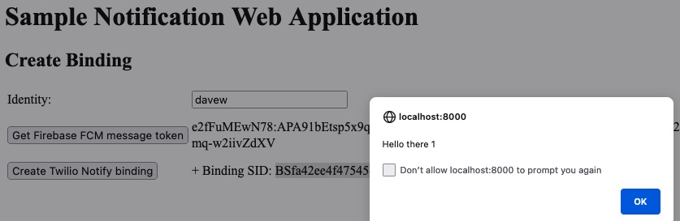
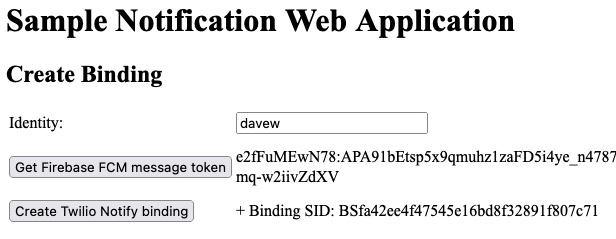

# Twilio Notify Web Application Implementation

These are the steps to set up, configure, and run 
a sample Twilio Notify notification web application.
Once running, you can use a command line program to send notifications to the
browser that is running the web notification application.



## Create a Google Firebase Project to Use

Create a [Google Firebase project](https://console.firebase.google.com/)
that will will map to the Notify web application.
I used my personal Google account.
````
Click Add project.
Project Name: tignotify
Disable:  Enable Google Analytics for this project.
Click Create Project, Your new project is ready. Click Continue.
Get started by adding Firebase to your app ... Click Android icon.
Use an Android package name such as: "com.twilio.notify.quickstart".
Click register app.
````

### Add the Firebase Server Key into a New Twilio Notify Push Credential Entry

Get the [Google project](https://console.firebase.google.com/)
tignotify's Project Settings/Cloud messaging, Server key Token.

Add the Server key Token value into a newly created/added
[Push Credential entry](https://www.twilio.com/console/notify/credentials/create).

For example:
````
Friendly Name: tignotifyweb
Type: FCM
FCM Secret: AAAA...Tx (Firebase Server key Token)
````
Click Save.

## Create a Notify Service

Create a Notify Service Instance: [Twilio Console link](https://www.twilio.com/console/notify/services). 

For example:
````
FRIENDLY NAME: tignotifyweb
FCM CREDENTIAL SID: tignotifyweb (the above newly created credential entry)
Logging: enabled
````
Click Save.

Example Notify Service SID:
````
IS0e9b3863450252891f81f312a6e3a7d7
````

Side note, I used the same Firebase Server key Token 
as when I implemented the Android Notify app to receive notifications.

## Download this Web Application that can Receive Twilio Notify Notifications

If you have the GitHub tools installed, you can clone this repository to your disk.
````
cd /Users/<user>/Projects/
$ git clone https://github.com/tigerfarm/notifyweb
...
$ cd notifyweb/
````

Or, download the ZIP into a working directory, and unzip it.
````
cd /Users/<user>/Projects/
$ mkdir notifyweb
$ cd notifyweb/
````

After downloading, rename "docroot/indexShow.html" to "docroot/index.html"

#### Files

- [docroot/index.html](docroot/indexShow.html) : Client HTML
- [docroot/notify_actions.js](docroot/notify_actions.js) : Client JavaScript functions
- [docroot/firebase-messaging-sw.js](docroot/firebase-messaging-sw.js) : JavaScript used by the Firebase JavaScript libraries
- [webserver.js](webserver.js) : a NodeJS Express HTTP Server that serves the client files.

#### Use the Google Firebase Project Information in the Web Application

In the file: firebase-messaging-sw.js,
set the value for messagingSenderId, to the Firebase "Project number".
Its listed under the Firebase project settings: "General".
````
firebase.initializeApp({
    'messagingSenderId': "5...1"
});
````
In the index.html file,
set the value for messagingSenderId, to the "Project number".
Set the value for apiKey, to the "Web API Key".
Both are listed under the Firebase project settings: "General".
Setting the projectId is optional. I use it to echo the Firebase project I was using.
````
            var config = {
                apiKey: "AI...Q",
                projectId: "tignotify",
                messagingSenderId: "5...1"
            };
````

Install the Express and Twilio modules.
````
$ npm install --save express
$ npm install --save twilio
````
Run the web server. Default port is hardcoded to 8000.
````
$ node websever.js
+++ Notify web application server is starting up.
+ Notify service SID: IS0e9b3863450252891f81f312a6e3a7d7
+ Twilio client object created for Twilio account: ACa...3
+ Listening on port: 8000
````
In a web browser, goto the [link](http://localhost:8000/)(http://localhost:8000/).
````
Enter an Identity such as "davew".
Click "Get Firebase FCM message token".
The token is displayed.
Click "Create Twilio Notify binding".
The Twilio Notify Binding id is displayed.
````
Sample run:



Use a command line program to list the newly created binding.

Sample run:
````
$ node listBindings.js 
+++ List bindings for a Notify service.
+ Notify service SID: IS0e9b3863450252891f81f312a6e3a7d7
+ The listing:
++ Binding-SID bindingType(fcm,apn):identity<address>)
++ BSfa42ee4f47545e16bd8f32891f807c71 fcm:davew<e2fFuMEwN78:APA9...dXV>
````

## Send a notification:

When sending, include:
+ The Notify service SID, which has the FCM CREDENTIAL SID (FCM Credential information: SID, type: FCM, and FCM SECRET)
+ The app user's identity, which matches to the binding, which as the identity + the device id.
+ The notification message to send.

The above information stored with Twilio, is the link between:
+ Your sending program,
+ To the Google(FCM) network. Or Apple(APN) networks if the app in on an iOS device.
+ To app on the specific device.

Use the send notification program to send a notification to the app user.
In the file, sendNotification.js, set identity to the identity you used in the web application.
For example:
````
identity: 'davew',
````

Sample program run:
````
$ node sendNotification.js 
+++ Start sending notifications to an identity.
+ Sent: NT3f22872f3635ed14e3c4295cca45ac21
````
Or, use a curl command.
````
curl -X POST https://notify.twilio.com/v1/Services/IS0e9b3863450252891f81f312a6e3a7d7/Notifications \
    -d 'Identity=davew' \
    -d 'Body=Hello there 1' \
    -u $MASTER_ACCOUNT_SID:$MASTER_AUTH_TOKEN
````
The notification will be received on the phone that is running the notification app.


--------------------------------------------------------------------------------
#### The following Firebase steps failed

The steps are based on the Twilio Conversations
[documentation](https://www.twilio.com/docs/conversations/javascript/push-notifications-web).

Create a Google Firebase [project](https://console.firebase.google.com/)
that will will map to the Notify web application. I used my personal Google account.
````
Click Add project
Project Name: tignotifyweb
Disable:  Enable Google Analytics for this project.
Click Create Project, Your new project is ready. Click Continue.
Get started by adding Firebase to your app ... Click web icon ("</>").
Register app, app nickname: tignotifyweb.
Click register app.
````
Firebase Step (2) Add Firebase SDK sample code snippet:
````
// Import the functions you need from the SDKs you need
import { initializeApp } from "firebase/app";
// TODO: Add SDKs for Firebase products that you want to use
// https://firebase.google.com/docs/web/setup#available-libraries

// Your web app's Firebase configuration
const firebaseConfig = {
  apiKey: "AI...",
  authDomain: "tignotifyweb.firebaseapp.com",
  projectId: "tignotifyweb",
  storageBucket: "tignotifyweb.appspot.com",
  messagingSenderId: "70...",
  appId: "1:70...6:web:de03..."
};

// Initialize Firebase
const app = initializeApp(firebaseConfig);
````
Note, if using Node.
````
$ npm install firebase
````
Click, Continue to Console.
````
Under "Firebase", beside Project Overview, click the settings icon and select: Project Settings.
Note, the above sample code, is listed here under the "General" settings.
The code has your Web API Key(as above, apiKey: "AI..._vr...").

--------------------------------------------------------------------------------
### Documentation Links

Configuring Android Push Notifications
[documentation](https://www.twilio.com/docs/notify/configure-android-push-notifications).

General set up [documentation](https://www.twilio.com/docs/conversations/javascript/push-notifications-web)
steps I followed.

[Documentation](https://www.twilio.com/docs/notify/quickstart/firebase-web)
to create the Twilio Notification credentials.

My application sample is a modified:
[TwilioDevEd sample](https://github.com/TwilioDevEd/notify-quickstart-webpush).

[Tutorial docs](https://www.twilio.com/docs/notify/quickstart/firebase-web).

--------------------------------------------------------------------------------

Cheers...
