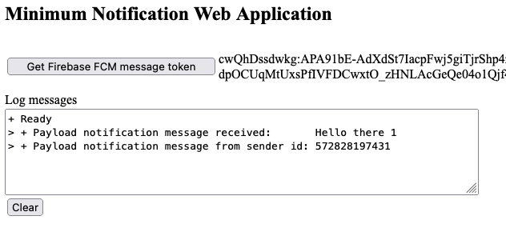
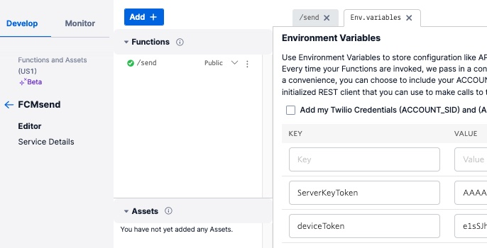
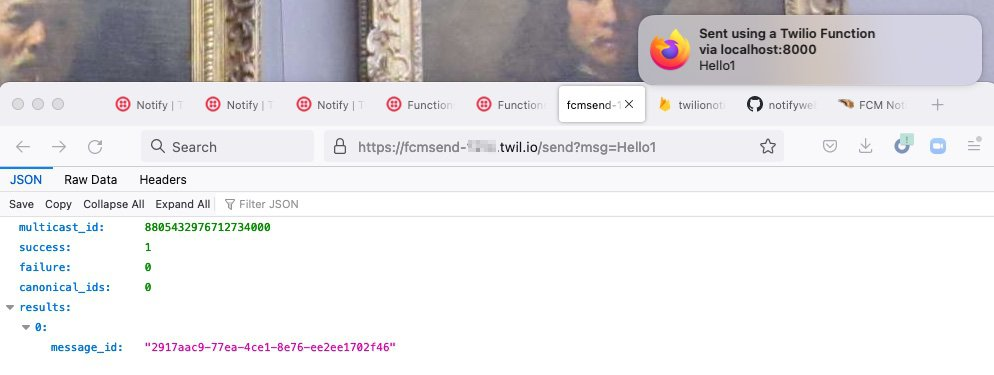

#### Files in the "address" directory

- [webserver.js](webserver.js) : a NodeJS Express HTTP Server that serves the client files.
- [sendAddress.js](sendAddress.js) : a NodeJS command line program to send a Twilio Notify notification using the device application address(FCM token).
- [sendFcmNotification.js](sendFcmNotification.js) : a NodeJS command line program to send a Firebase notification(not using Twilio Notify) using the FCM token.
- [docroot/index.html](docroot/index.html) : Client HTML, includes Client JavaScript functions
- [docroot/firebase-messaging-sw.js](docroot/firebase-messaging-sw.js) : Background notification processing

# FCM Notification Web Application Implementation

This web application can receive notifications sent from Twilio Notify or directly from an FCM HTTP request.

These are the steps to implement and test:
+ Go through the other [../README.md](../README.md) to setup an FCM project and Twilio Notify configurations.
+ Set up, configure, and run the simple sample web application to request an FCM device address token that is used to receive FCM notifications.
+ Using the web application, you will retrieve a Firebase Cloud Messaging(FCM) token(device address token) in the browser.
+ Use the token to send notifactions using the included Twilio Notify command line program: [sendAddress.js](sendAddress.js) or [sendFcmNotification.js](sendFcmNotification.js).
+ Or, set up and use a Twilio Function, that makes an FCM HTTP request to send notications (see below).
+ Notifications will be received by the browser application, or in the background by the OS.
+ This application was use to test [Twilio Conversations](https://github.com/tigerfarm/tfpconversations) notifications.

Screen print of FCM generated token("cwQ...") and a received notification displayed in the browser application:



## Impliment the Web Application

To run the Web Application, Node needs to be installed and available. I'm using Node version 17.9.0.
````
$ node -v
v17.9.0
````

### Download the Web Application that can Receive Twilio Notify Notifications

If you have the GitHub tools installed, you can clone this 
[GitHub repository](https://github.com/tigerfarm/notifyweb)
to your disk.
````
cd /.../Projects/
$ git clone https://github.com/tigerfarm/notifyweb
...
$ cd notifyweb/address
````

Or, download the [GitHub project Zip file](https://github.com/tigerfarm/notifyweb)
into a working directory, and unzip it.
````
cd /Users/<user>/Projects/
$ mkdir notifyweb
$ mkdir notifyweb/address
$ cd notifyweb/address
````

#### Use the Google Firebase Project Information in the Web Application

In the index.html file,
set the messagingSenderId value, to the Firebase "Sender ID"(example: "6...4").
Set the value for apiKey, to the "Web Push certificates: key pair" value(example: "BBZ...HA").
Both are listed under the Firebase project settings: Firebase/Project Overview(click icon)/Project setting/Cloud Messaging.
````
            var config = {
                apiKey: "BBZWL...qHA",
                messagingSenderId: "69...4"
            };
````
In the file: firebase-messaging-sw.js,
set the messagingSenderId value, to the Firebase "Sender ID"(example: "5...1").
Its listed under the Firebase project settings: "Cloud Messaging".
````
firebase.initializeApp({
    'messagingSenderId': "69...4"
});
````

Install the Node Express modules.
````
$ npm install --save express
````

Run the web server. Default port is hardcoded to 8000.
````
$ node webserver.js 
+++ Minimum Notification Web Application server is starting up.
+ Listening on port: 8000
````

## Get a Google Firebase Token

In a web browser, goto the [link](http://localhost:8000/index.html)(http://localhost:8000/).

The index.html file loads the following Google Firebase librares.
````
        <script src="https://www.gstatic.com/firebasejs/4.8.0/firebase-app.js"></script>
        <script src="https://www.gstatic.com/firebasejs/4.8.0/firebase-messaging.js"></script>
````

Have the JavaScript function request a Google Firebase Token.
````
Click "Get Firebase FCM message token".
    The token is displayed, for example: "cw...YX".
````
The program passes the Firebase Sender ID and Web Push certificate key pair value
to the Google Firebase library which returns the token.
The token is displayed on the webpage.

Function to request and receive a Google Firebase token.
````
            function GetFirebaseToken() {
                if (firebase && firebase.messaging()) {
                    // requesting permission to use push notifications
                    firebase.messaging().requestPermission().then(() => {
                        // getting FCM token
                        firebase.messaging().getToken().then((fcmToken) => {
                            document.getElementById("fcmToken").innerText = fcmToken;
                        }).catch((err) => {
                            logger("- Error: Can't get token: " + err);
                        });
                    }).catch((err) => {
                        logger("- Error: user has not granted permission.");
                        logger(err);
                    });
                } else {
                    logger("- Error: Firebase library not initialized.");
                }
            }
````

## Send a notification:

Once the FCM token is retrieved,
notifications can be sent to the device using the FCM token.
````
if the web application is running in the browser, 
    notifications will be handled by the application.
if the web application tab is closed, or the browser is closed,
    notifications will be handled by the device's OS.
````

Use the send notification program: [sendAddress.js](sendAddress.js), to send a notification to the device.

In the file, sendAddress.js, set "address" to the above retrieved FCM token value(example: "cw...YX").

For example:
````
client.notify.services(notifyServiceSid).notifications.create({
    body: 'Hello there ',
    toBinding: [
        JSON.stringify({"binding_type": "fcm", "address": "cw...YX"})
    ]
})
````

Install the Node Twilio module.
````
$ npm install --save twilio
````
Set environment variables. Or, hardcode them into the program: sendAddress.js.
````
$ export MASTER_NOTIFY_SID=IS0e9b3863450252891f81f312a6e3a7d7
$ export MASTER_ACCOUNT_SID=AC...
$ export MASTER_AUTH_TOKEN=...
````

Sample program run:
````
$ node sendAddress.js 
+++ Send a notifications to an FCM token address or device address.
+ Twilio Notify service SID: IS0e9b3863450252891f81f312a6e3a7d7
+ Sent, Twilio Notify log id: NTea47fb9ca9bc391f923dd2c999153a06
````
Or, use a curl command.
````
curl -X POST https://notify.twilio.com/v1/Services/IS0e9b3863450252891f81f312a6e3a7d7/Notifications \
    -d 'Body=Hello there 1' \
    --data-urlencode 'ToBinding={"binding_type":"fcm", "address":"cw...YX"}' \
    -u $MASTER_ACCOUNT_SID:$MASTER_AUTH_TOKEN
{
"account_sid": "ACa...3",
"sid": "NTea47fb9ca9bc391f923dd2c999153a06", 
"service_sid": "IS0e9b3863450252891f81f312a6e3a7d7", 
"identities": ["davew"],
"body": "Hello there 1", 
"sms": null, "gcm": null, "fcm": null, "apn": null, "alexa": null, "facebook_messenger": null, 
"ttl": 2419200,
"priority": "high", 
"data": null, 
"action": null, "date_created": "2022-06-09T20:23:10Z", 
"sound": null, "tags": [], "title": null, "segments": [], 
}
/Users/dave/conversations
````
The notification will be received on the device where the FCM token was received.
Either handled in the application, or handled by the OS in the background.

Note, if the logs show a message with state: SENT,
and, however, it was not received, the "address" maybe incorrect.

### About the Send

The sending program notification parameters:
+ Twilio account SID and token
+ Notify service SID: IS0e9b3863450252891f81f312a6e3a7d7
    which has the FCM CREDENTIAL SID (type: FCM, and FCM SECRET), FCM Secret: AAAA...x6r (Firebase Server key Token)
+ Destination address: the application-user Firebase project token(e2fFuMEwN78:APA9...dXV)
    that was retrieved in the browser(firebase.messaging().getToken()).
+ Message text: 'Hello there 1'

Notification flow:
+ From your sending program(Twilio account SID and token) to Twilio.
+ From Twilio(FCM access: FCM SECRET) to the Google(FCM) network.
+ From Google(FCM) network to the destination application-user(ID: Firebase project token)
    that is(or was) running the application.
+ Notification message text is processed on the device.

--------------------------------------------------------------------------------
## Twilio Function to Send a Direct FCM Notification

For reference, Firebase [Authorize HTTP requests](https://firebase.google.com/docs/cloud-messaging/auth-server#authorize-http-requests).

Twilio Functions to send notifications:
+ Create a new functions service in the Twilio Console and give it a name: FCMsend.
+ In the Functions Editor/Dependencies, add [axios with a recent version](https://www.npmjs.com/package/axios).
I'm using axios version: 0.27.2.
+ Rename the default "/welcome" function to "/send".
+ Add the below code into the "/send" function.
+ In Environment Variables, add ServerKeyToken: your FCM server key token, example: "AAAA...x6r".
+ In Environment Variables, add deviceToken: your device's FCM token, example: "cw...YX".
````
const axios = require('axios');
exports.handler = async (context, event, callback) => {
  try {
    // capture any info provided in the query string (e.g. msg)
    // https://abouttime-2357.twil.io/send?msg=Hello1
    var sendMessage = event.msg;
    // build notification
    var notification = {
        "title": "Sent using a Twilio Function",
        "body": sendMessage
        // , "click_action": "<URL_OF_ACTION>"
      };
    console.log("+ Message to send: " + sendMessage);
    console.log("+ Send message to: " + context.deviceToken);
    console.log("+ Using ServerKeyToken: " + context.ServerKeyToken);
    const response = await axios.post('https://fcm.googleapis.com/fcm/send', {
      notification: notification,
      to: context.deviceToken
    },
    { 
      headers: {
        "Content-Type": "application/json",
        "Authorization": "key="+ context.ServerKeyToken
      }
    });
    return callback(null, response.data);
  } catch (error) {
    // In the event of an error, return a 500 error and the error message
    console.error(error);
    return callback(error);
  }
};
````
The Twilio Function's Environment Variables:



Use the Twilio Function's URL with a message. For example:
````
https://fcmsend-2357.twil.io/send?msg=Hello1
````
Or use a curl command using the Firebase Server key Token("AAAA...x6r") and the FCM device address token("cw...YX"):
````
curl -i -L -X POST 'https://fcm.googleapis.com/fcm/send' \
-H 'Content-Type: application/json' \
-H 'Authorization: key=AAAA...x6r' \
--data-raw '{
  "to" : "cw...YX",
  "notification": {"title":"Sent using a Twilio Function","body":"Hello1"}
}'
````
OR, use the command line HTTP request program.
````
$ export FCM_SERVER_KEY_TOKEN=AAAA...x6r
$ export FCM_DEVICE_TOKEN=cw...YX
$ node sendFcmNotification.js
+++ Send an FCM notification.
+ serverKeyToken: AAAA...x6r
+ deviceToken: cw...YX
+ theRequestUrl: https://fcm.googleapis.com/fcm/send
+ theMessage: Hello1
+ body: {"multicast_id":7747101136704970000,"success":1,"failure":0,"canonical_ids":0,"results":[{"message_id":"c460e90f-09c9-4842-bed2-23764683d391"}]}
+++ Exit.
````

The notification shows up:



Another sample command to send a notification.
````
curl -i -L -X POST 'https://fcm.googleapis.com/fcm/send' \
-d '{
  "to": "cw...YX",
   "notification": {
     "title" : "The title here",
     "body" : "Hello 1a"
   }
}' \
-H "Application/json" \
-H "Content-type: application/json" \
-H "Authorization: key=AAAA...x6r"  \
````
--------------------------------------------------------------------------------

Cheers...
