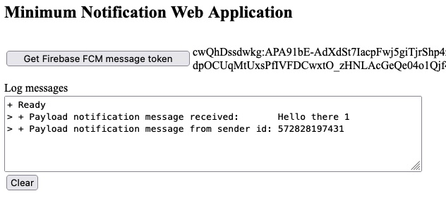

#### Files in the "address" directory

- [webserver.js](webserver.js) : a NodeJS Express HTTP Server that serves the client files.
- [sendAddress.js](sendAddress.js) : a NodeJS command line program to send a Twilio Notify notification using the device application address.
- [docroot/index.html](docroot/index.html) : Client HTML, includes Client JavaScript functions
- [docroot/firebase-messaging-sw.js](docroot/firebase-messaging-sw.js) : Background notification processing

# Twilio Notify Web Application Implementation

These are the steps to:
+ Set up, configure, and run
a simple sample web application to receive Twilio Notify notifications.
+ Using the web application, you will retrieve a Firebase Cloud Messaging(FCM) token in the browser.
+ Use the token to send a notications using the included 
Twilio Notify command line program.
+ Notifications will be received by the browser application, or in the background.

FCM token("cwQ...") and a received notification displayed in the browser application:



## Impliment the Web Application

To run the Web Application, Node needs to be installed and available. I'm using Node version 17.9.0.
````
$ node -v
v17.9.0
````

### Download the Web Application that can Receive Twilio Notify Notifications


If you have the GitHub tools installed, you can clone this 
[GitHub repository](https://github.com/tigerfarm/notifyweb)
to your disk.
````
cd /.../Projects/
$ git clone https://github.com/tigerfarm/notifyweb
...
$ cd notifyweb/address
````

Or, download the [GitHub project Zip file](https://github.com/tigerfarm/notifyweb)
into a working directory, and unzip it.
````
cd /Users/<user>/Projects/
$ mkdir notifyweb
$ mkdir notifyweb/address
$ cd notifyweb/address
````

#### Use the Google Firebase Project Information in the Web Application

In the file: firebase-messaging-sw.js,
set the messagingSenderId value, to the Firebase "Sender ID"(example: "5...1").
Its listed under the Firebase project settings: "Cloud Messaging".
````
firebase.initializeApp({
    'messagingSenderId': "5...1"
});
````
In the index.html file,
set the messagingSenderId value, to the Firebase "Sender ID"(example: "5...1").
Set the value for apiKey, to the "Web Push certificates: key pair" value(example: "AI...Q").
Both are listed under the Firebase project settings: "Cloud Messaging".
````
            var config = {
                apiKey: "AI...Q",
                messagingSenderId: "5...1"
            };
````

Install the Node Express modules.
````
$ npm install --save express
````

Run the web server. Default port is hardcoded to 8000.
````
$ node webserver.js 
+++ Minimum Notification Web Application server is starting up.
+ Listening on port: 8000
````

## Get a Google Firebase Token

In a web browser, goto the [link](http://localhost:8000/)(http://localhost:8000/).
````
Click "Get Firebase FCM message token".
    The token is displayed, for example: "cw...YX".
````
The program passes the Firebase Sender ID and Web Push certificate key pair value
to the Google Firebase library which returns the token.

## Send a notification:

Once the FCM token is retrieved,
notifications can be sent to the device using the FCM token.
````
if the web application is running in the browser, 
    notifications will be handled by the application.
if the web application tab is closed, or the browser is closed,
    notifications will be handled by the device's OS.
````

Use the send notification program: [sendNotification.js](sendNotification.js), to send a notification to the device.

In the file, sendNotification.js, set "address" to the above retrieved FCM token value(example: "cw...YX").

For example:
````
client.notify.services(notifyServiceSid).notifications.create({
    body: 'Hello there ',
    toBinding: [
        JSON.stringify({"binding_type": "fcm", "address": "cw...YX"})
    ]
})
````

Install the Node Twilio module.
````
$ npm install --save twilio
````
Set environment variables. Or, hardcode them into the program: sendAddress.js.
````
$ export MASTER_NOTIFY_SID=IS0e9b3863450252891f81f312a6e3a7d7
$ export MASTER_ACCOUNT_SID=AC...
$ export MASTER_AUTH_TOKEN=...
````

Sample program run:
````
$ node sendAddress.js 
+++ Send a notifications to an FCM token address or device address.
+ Twilio Notify service SID: IS0e9b3863450252891f81f312a6e3a7d7
+ Sent, Twilio Notify log id: NTea47fb9ca9bc391f923dd2c999153a06
````
Or, use a curl command.
````
curl -X POST https://notify.twilio.com/v1/Services/IS0e9b3863450252891f81f312a6e3a7d7/Notifications \
    -d 'Body=Hello there 1' \
    --data-urlencode 'ToBinding={"binding_type":"fcm", "address":"cw...YX"}' \
    -u $MASTER_ACCOUNT_SID:$MASTER_AUTH_TOKEN
{
"account_sid": "ACa...3",
"sid": "NTea47fb9ca9bc391f923dd2c999153a06", 
"service_sid": "IS0e9b3863450252891f81f312a6e3a7d7", 
"identities": ["davew"],
"body": "Hello there 1", 
"sms": null, "gcm": null, "fcm": null, "apn": null, "alexa": null, "facebook_messenger": null, 
"ttl": 2419200,
"priority": "high", 
"data": null, 
"action": null, "date_created": "2022-06-09T20:23:10Z", 
"sound": null, "tags": [], "title": null, "segments": [], 
}
/Users/dave/conversations
````
The notification will be received on the device where the FCM token was received.
Either handled in the application, or handled by the OS in the background.

Note, if the logs show a message with state: SENT,
and, however, it was not received, the "address" maybe incorrect.

### About the Send

The sending program notification parameters:
+ Twilio account SID and token
+ Notify service SID: IS0e9b3863450252891f81f312a6e3a7d7
    which has the FCM CREDENTIAL SID (type: FCM, and FCM SECRET)
+ Destination address: the application-user Firebase project token(e2fFuMEwN78:APA9...dXV)
    that was retrieved in the browser(firebase.messaging().getToken()).
+ Message text: 'Hello there 1'

Notification flow:
+ From your sending program(Twilio account SID and token) to Twilio.
+ From Twilio(FCM access: FCM SECRET) to the Google(FCM) network.
+ From Google(FCM) network to the destination application-user(ID: Firebase project token)
    that is(or was) running the application.
+ Notification message text is processed on the device.

--------------------------------------------------------------------------------

Cheers...
