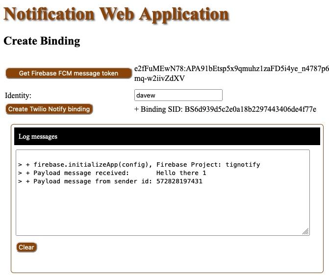

#### Files in the "bindings" directory

- [webserver.js](webserver.js) : a NodeJS Express HTTP Server that serves the client files.
- [sendBinding.js](sendBinding.js) : a NodeJS command line program to send a Twilio Notify notification using the binding identity.
- [docroot/index.html](docroot/index.html) : Client HTML, includes Client JavaScript functions
- [docroot/notify_actions.js](docroot/notify_actions.js) : Client JavaScript functions
- [docroot/firebase-messaging-sw.js](docroot/firebase-messaging-sw.js) : Background notification processing

# Twilio Notify Web Application Implementation

These are the steps to set up, configure, and run 
a sample Twilio Notify notification web application.
Once running, you can use a command line program to send notifications to the
browser that is running the web notification application.

Receiving a notification in the browser application: 



## Impliment the Web Application

To run the Web Application, you will need to Node installed and available. I'm using Node version 17.9.0.
````
$ node -v
v17.9.0
````

### Download the Web Application that can Receive Twilio Notify Notifications

If you have the GitHub tools installed, you can clone this repository to your disk.
````
cd /.../Projects/
$ git clone https://github.com/tigerfarm/notifyweb
...
$ cd notifyweb/bindings
````

Or, download the ZIP into a working directory, and unzip it.
````
cd /Users/<user>/Projects/
$ mkdir notifyweb
$ mkdir notifyweb/bindings
$ cd notifyweb/bindings
````

#### Files

- [docroot/index.html](docroot/index.html) : Client HTML
- [docroot/notify_actions.js](docroot/notify_actions.js) : Client JavaScript functions
- [docroot/firebase-messaging-sw.js](docroot/firebase-messaging-sw.js) : JavaScript used by the Firebase JavaScript libraries
- [webserver.js](webserver.js) : a NodeJS Express HTTP Server that serves the client files.

#### Use the Google Firebase Project Information in the Web Application

In the file: firebase-messaging-sw.js,
set the messagingSenderId value, to the Firebase "Sender ID"(example: "69...4").
Its listed under the Firebase project settings: "Cloud Messaging".
````
firebase.initializeApp({
    'messagingSenderId': "69...4"
});
````
In the index.html file,
set the messagingSenderId value, to the Firebase "Sender ID"(example: "5...1").
Set the value for apiKey, to the "Web Push certificates: key pair" value(example: "AI...Q").
Both are listed under the Firebase project settings: "Cloud Messaging".
Setting the projectId is optional. I use it to echo the Firebase project I was using.
````
            var config = {
                apiKey: "BBZWL...qHA",
                projectId: "twilionotify",
                messagingSenderId: "69...4"
            };
````

Install the Express and Twilio modules.
````
$ npm install --save express
$ npm install --save twilio
````
Set environment variables. Or, hardcode them into the program: websever.js.
````
$ export MAIN_NOTIFY_SID=IS0e9b3863450252891f81f312a6e3a7d7
$ export MAIN_ACCOUNT_SID=AC...
$ export MAIN_AUTH_TOKEN=...
````
Run the web server. Default port is hardcoded to 8000.
````
$ node webserver.js
+++ Notify web application server is starting up.
+ Notify service SID: IS0e9b3863450252891f81f312a6e3a7d7
+ Twilio client object created for Twilio account: ACa...3
+ Listening on port: 8000
````

## Register/Create a Twilio Notify Binding

In a web browser, goto the [link](http://localhost:8000/)(http://localhost:8000/).
````
Click "Get Firebase FCM message token".
    The token is displayed.
Enter an Identity such as "davew".
Click "Create Twilio Notify binding".
    The Twilio Notify Binding id is displayed.
````
The binding is created using the identity and the FCM message token.

Sample run:


Use a command line program to list the newly created binding.
Note the above environment variables are required.

Sample run:
````
$ node listBindings.js 
+++ List bindings for a Notify service.
+ Notify service SID: IS0e9b3863450252891f81f312a6e3a7d7
+ The listing:
++ Binding-SID bindingType(fcm,apn):identity<address>)
++ BS6d939d5c2e0a18b2297443406de4f77e fcm:davew<e2fFuMEwN78:APA9...dXV>
````

The binding could also be created using the program: createBinding.js,
by copying the address into the theAddress value.
````
$ node createBinding.js 
+++ Create an FCM Binding.
+ Notify service SID: IS0e9b3863450252891f81f312a6e3a7d7
+ Create FCM binding, Identity: davec, address:cwQhDssdwkg:APA91bE-AdXdSt7IacpFwj5giTjrShp4ni0rZ1BqcerB8wYRDYI-dpOCUqMtUxsPfIVFDCwxtO_zHNLAcGeQe04o1Qjf474t_fP_71D87YxjVfumQOarHU0uLFWKRnn-BiS-MkwkdBYX:
+ Created : BSea26846742d5286f319ed971542e99cc

$ node listBindings.js
+++ List bindings for a Notify service.
+ Notify service SID: IS0e9b3863450252891f81f312a6e3a7d7
+ The listing:
++ Binding-SID bindingType(fcm,apn):identity<address>)
++ BSea26846742d5286f319ed971542e99cc fcm:davec<e2fFuMEwN78:APA9...dXV>
++ BS6d939d5c2e0a18b2297443406de4f77e fcm:davew<e2fFuMEwN78:APA9...dXV>
````

## Send a notification:

Once the FCM token is retrieved and the Twilio binding created,
notifications can be sent to the device using the binding identity.
````
if the web application is running in the browser, 
    notifications will be handled by the application (see above).
if the web application tab is closed, or the browser is closed,
    notifications will be handled by the device's OS (see below).
````

Use the send notification program(sendNotification.js) to send a notification to the app user.

In the file, sendNotification.js, set identity to the Twilio Notify registered identity.

For example:
````
const theIdentity = 'davew';
client.notify.services("IS0e9b3863450252891f81f312a6e3a7d7").notifications.create({
    identity: theIdentity,
    body: 'Hello there 1'
})
````

Sample program run:
````
$ node sendBinding.js 
+++ Start sending notifications to an identity.
+ Sent: NTea47fb9ca9bc391f923dd2c999153a06
````
Or, use a curl command.
````
$ curl -X POST https://notify.twilio.com/v1/Services/IS0e9b3863450252891f81f312a6e3a7d7/Notifications \
    -d 'Identity=davew' \
    -d 'Body=Hello there 1' \
    -u $MAIN_ACCOUNT_SID:$MAIN_AUTH_TOKEN
$ curl -X POST https://notify.twilio.com/v1/Services/IS0e9b3863450252891f81f312a6e3a7d7/Notifications -d 'Identity=davew' -d 'Body=Hello there 1' -u $MAIN_ACCOUNT_SID:$MAIN_AUTH_TOKEN
{
"account_sid": "ACa...3", 
"sid": "NTea47fb9ca9bc391f923dd2c999153a06", 
"service_sid": "IS0e9b3863450252891f81f312a6e3a7d7", 
"identities": ["davew"],
"body": "Hello there 1", 
"sms": null, "gcm": null, "fcm": null, "apn": null, "alexa": null, "facebook_messenger": null, 
"ttl": 2419200,
"priority": "high", 
"data": null, 
"action": null, "date_created": "2022-06-09T20:23:10Z", 
"sound": null, "tags": [], "title": null, "segments": [], 
}
/Users/dave/conversations
````
The notification will be received on the device where the Twilio Notify binding was registered.
Either handled in the application, or handled by the OS in the background.

Sample send where the NOtify request was successful, but nothing was sent.
````
$ node sendNotification.js 
+++ Start sending notifications to an identity.
+ Notify service SID: IS0e9b3863450252891f81f312a6e3a7d7
+ Sent: NT10483e690f1df0fc20dca87447b59ede
````
If the logs do not show any thing for a Notify log id (Twilio Console: No rows to display), 
then the binding may not exist.

### About the Send

The sending program notification parameters:
+ Twilio account SID and token
+ Notify service SID: IS0e9b3863450252891f81f312a6e3a7d7
    which has the FCM CREDENTIAL SID (type: FCM, and FCM SECRET)
+ Destination address: the application-user Firebase project token(e2fFuMEwN78:APA9...dXV)
    that was retrieved in the browser(firebase.messaging().getToken()).
+ Message text: 'Hello there 1'

Notification flow:
+ From your sending program(Twilio account SID and token) to Twilio.
+ From Twilio(FCM access: FCM SECRET) to the Google(FCM) network.
+ From Google(FCM) network to the destination application-user(ID: Firebase project token)
    that is(or was) running the application.
+ Notification message text is processed on the device.

--------------------------------------------------------------------------------

Cheers...
