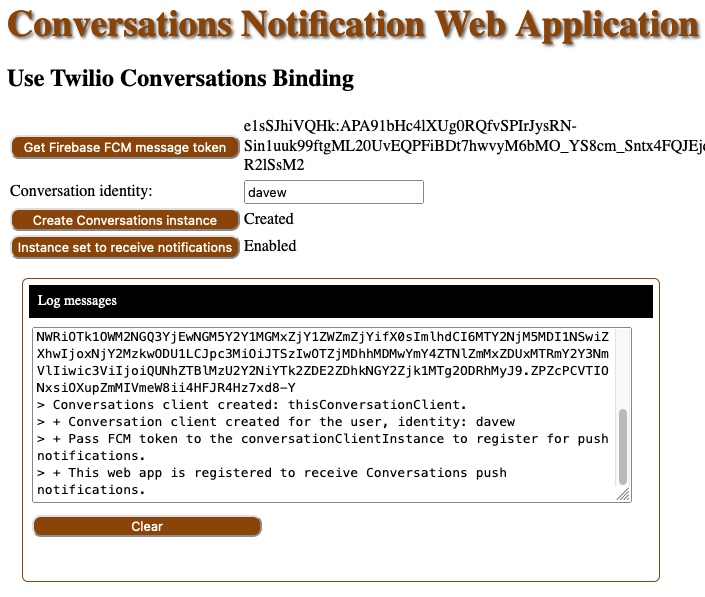

#### Files in the "address" directory

Web application files:
- [webserver.js](webserver.js) : a NodeJS Express HTTP web server that serves the client files.
- [docroot/index.html](docroot/index.html) : Client HTML, includes Client JavaScript functions
- [docroot/notify_actions.js](docroot/notify_actions.js) : Client JavaScript functions
- [docroot/firebase-messaging-sw.js](docroot/firebase-messaging-sw.js) : Background notification processing

Command line programs for testing:
- [servicesConversationFetchOne.js](servicesConversationMsgCreate.js) : Fetch a Twilio Conversations conversation's information.
- [servicesConversationMsgCreate.js](servicesConversationMsgCreate.js) : create/send a conversation message.
- [servicesConversationMsgListAll.js](servicesConversationMsgListAll.js) : list all messages in a conversation.
- [servicesConversationMsgRemoveAll.js](servicesConversationMsgRemoveAll.js) : remove all messages from a conversation.
- [servicesConversationParticipantCreateChat.js](servicesConversationParticipantCreateChat.js) : create a conversation chat participant.
- [servicesConversationParticipantRemove.js](servicesConversationParticipantRemove.js) : remove a conversation's participant.
- [servicesConversationParticipantsList.js](servicesConversationParticipantsList.js) : list all participant for a conversation.

--------------------------------------------------------------------------------
# Web Application Implementation

These are the steps to set up, configure, and run 
a sample web application where the client, that runs in a browser,
can receive Twilio Conversations notifications.

Client running in the browser: 



--------------------------------------------------------------------------------
## Download the Web Application that can Receive Notifications

If you have the GitHub tools installed, you can clone this repository to your disk.
````
cd /.../Projects/
$ git clone https://github.com/tigerfarm/notifyweb
...
$ cd notifyweb/conversations
````

Or, download the ZIP into a working directory, and unzip it.
````
cd /Users/<user>/Projects/
$ mkdir notifyweb
$ mkdir notifyweb/conversations
$ cd notifyweb/conversations
````

#### Use the Google Firebase Project Information in the Web Application

If you haven't, go through the steps in the higher level [README](../README.md):
+ Create a [Google Firebase project](https://console.firebase.google.com/). I'm using: twilionotify.
+ Create a [Twilio Mobile Push Credentials](https://console.twilio.com/us1/develop/notify/try-it-out?frameUrl=%2Fconsole%2Fnotify%2Fcredentials%3F__override_layout__%3Dembed%26bifrost%3Dtrue%26x-target-region%3Dus1) entry.

In the index.html file,
````
Set the value for apiKey. In the [Google Firebase console](https://console.firebase.google.com/)
    Project: twilionotify
    Firebase/Project Overview/Project settings/Cloud Messaging/Web configuration/Web configuration,
    Web Push certificates: key pair, example: "BBZWL...qHA".
Set the messagingSenderId value, to the Firebase "Sender ID", example: "69...4".
Setting the projectId is optional. I use it to echo the Firebase project I was using.
            var config = {
                apiKey: "BBZWL...qHA",
                projectId: "twilionotify",
                messagingSenderId: "69...4"
            };
````
In the file: firebase-messaging-sw.js,
````
Set the messagingSenderId value, to the Firebase "Sender ID", example: "69...4".
firebase.initializeApp({
    'messagingSenderId': "69...4"
});
````

--------------------------------------------------------------------------------
## Prepare the Environment

To run the Web Application, you will need to Node installed and available. I'm using Node version 17.9.0.
````
$ node -v
v17.9.0
````

Set environment variables. Or, hardcode them into the program: websever.js.
````
$ export CONVERSATIONS_ACCOUNT_SID=AC...
$ export CONVERSATIONS_API_KEY=SK...
$ export CONVERSATIONS_API_KEY_SECRET=...
$ export CONVERSATIONS_SERVICE_SID=IS5c86b7d0d6e44133acb09734274f94f6
$ export FCM_CREDENTIAL_SID=CR5d...f6
````
Variables to generate Conversations access tokens,
````
Twilio Account:                 CONVERSATIONS_ACCOUNT_SID
                                CONVERSATIONS_API_KEY
                                CONVERSATIONS_API_KEY_SECRET
Conversations service SID:      CONVERSATIONS_SERVICE_SID
Twilio push credential SID:     FCM_CREDENTIAL_SID
````
Set up Conversations components using command line programs.
````
Create a conversation.
$ node servicesConversationCreate.js 
++ Create a conversation.
+ Messaging Service SID: IS5c86b7d0d6e44133acb09734274f94f6, Friendly and unique Name: Test notifications
+ Conversation SID: CHdb2a97f48028474da2eb168e7801df21 Test notifications

Create a conversation chat participant in the conversation.
The participant(davew) needs to join the conversation(note).
$ node servicesConversationParticipantCreateChat.js
++ Create an Chat participant for a conversation.
+ Conversations service SID: IS5c86b7d0d6e44133acb09734274f94f6
+ Conversation SID: CHdb2a97f48028474da2eb168e7801df21
+ Participant Identity: davew
+ Created participant, SID: MBa76d8408645d44dcb6529f182da0ba9e

$ node servicesConversationParticipantsList.js
++ List Participants for a Conversation.
+ Conversations service SID: IS5c86b7d0d6e44133acb09734274f94f6
+ Conversation SID: CHdb2a97f48028474da2eb168e7801df21
++ uniqueName:      note
++ state:           active
+ Participant SID: MBa76d8408645d44dcb6529f182da0ba9e identity, Chat: davew
````

--------------------------------------------------------------------------------
## Run a Test

Install the Express and Twilio modules.
````
$ npm install --save express
$ npm install --save twilio
````

Run the web server. Default port is hardcoded to 8000.
````
$ node websever.js
+++ Twilio Conversations web application server is starting up.
+ Twilio ACCOUNT_SID: ACae...a3
+ Twilio CONVERSATIONS_SERVICE_SID: IS5c86b7d0d6e44133acb09734274f94f6
+ Twilio FCM_CREDENTIAL_SID :CR5d...f6:
+ Listening on port: 8000
````
In a web browser, goto the [link](http://localhost:8000/)(http://localhost:8000/).
````
Get a Firebase FCM message token, for example:  firebaseFcmToken = e1sS...sM2
Enter an identity to use, for example:          davew
Create a Conversations conversation object
    Get a new Conversations token,              userIdentity = davew
    using the token instatiate a Conversations instance.
Set the conversation instance to receive notifications.
    thisConversationClient.setPushRegistrationId('fcm', firebaseFcmToken);
````
Now can receive notifications.

### Create a message in the channel.

The program creates a mess using author: davep1.
````
$ node servicesConversationMsgCreate.js
++ Create a text message for a Conversation.
+ Conversations service SID: IS5c86b7d0d6e44133acb09734274f94f6
+ Conversation SID: CHdb2a97f48028474da2eb168e7801df21
+ Participant Identity: davep1 messageText: msg1a
+ Created message, SID: IM8528c6bec4394d05816acc2641f58c9b
````
Message is created and notfication is sent, and displayed.

Note, since the message is sent from a program, the author does not need to be a participant in the channel.

#### Modify the notification messages structure.
In the Twilio console, go to 
````
Develop/Conversations/Manage/Services, services are listed.
Click your service Friendly Name.
Click left menu item: Push configuration.
Modify: Notification Text,
    From:   ${CONVERSATION}:${PARTICIPANT}: ${MESSAGE}
    To:     Test: ${CONVERSATION}:${PARTICIPANT}: ${MESSAGE}
````
Create another message in the conversation, and you'll see the modified notification message.

--------------------------------------------------------------------------------

Cheers...
